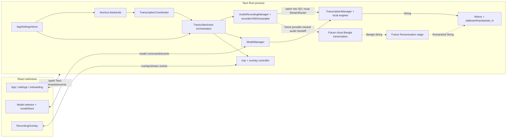
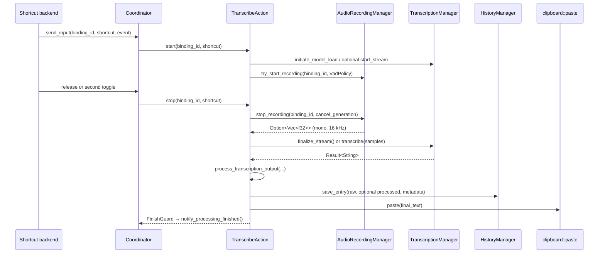
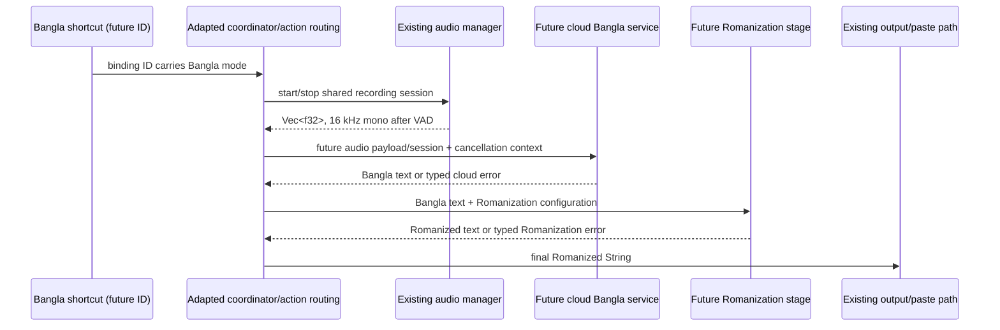

# Handy Codebase Map — Bangla Romanization Foundation

> Load this file as the first context file for future Bangla Romanization implementation tasks. It describes the repository at the snapshot below; re-check symbols and line numbers after the code changes.

## 1. Repository Snapshot

### Inspected revision

| Item            | Value                                                                              |
| --------------- | ---------------------------------------------------------------------------------- |
| Branch          | `bangla-romanization`                                                              |
| Commit          | `b50b52a8e398b8f07a498e18d9a19e3ad8bdf57e`                                         |
| Commit subject  | `fix(theme): appearance setting now reaches the overlay + macOS title bar (#1659)` |
| Package version | `0.9.5` in `package.json`, `src-tauri/Cargo.toml`, and `src-tauri/tauri.conf.json` |

This is a Tauri 2 desktop application. The backend is Rust 2021 (`src-tauri/src/`); the main and overlay webviews are React 18/TypeScript/Vite/Tailwind (`src/`). Frontend state is primarily Zustand. Rust services are Tauri managed state, usually `Arc<T>`. Tauri commands and typed events are collected with `tauri-specta`; `src/bindings.ts` is generated in debug builds and must not be hand-edited. Bun is the frontend package manager.

Supported build targets are macOS, Windows, and Linux. macOS is the primary behavioral target in this map: it uses an accessibility permission for keyboard injection/hotkeys, `tauri-nspanel` for a non-activating overlay, CoreAudio through `cpal`, a Secure Event Input monitor/Carbon shortcut fallback, Metal for `transcribe-cpp`, and an optional Apple Intelligence bridge on Apple silicon. Windows has registry-based microphone-permission diagnostics, a normal non-focusable overlay window, delayed-render clipboard transactions, x64 Vulkan/dynamic `transcribe-cpp` libraries, and a CPU-only ARM64 build.

### Meaningful tree

```text
Handy/
├── src/                              # React application and overlay
│   ├── main.tsx, App.tsx, bindings.ts
│   ├── components/                   # settings, onboarding, model UI, shared UI
│   ├── overlay/                      # separate recording-overlay webview
│   ├── stores/                       # Zustand settings/model state
│   ├── hooks/, lib/, utils/, styles/
│   ├── i18n/locales/                 # UI translations
│   └── content/release-notes/
├── src-tauri/
│   ├── src/
│   │   ├── main.rs, lib.rs            # binary entry and application bootstrap
│   │   ├── actions.rs                 # recording/transcription/output orchestration
│   │   ├── transcription_coordinator.rs
│   │   ├── managers/                  # audio, model, transcription, history
│   │   ├── audio_toolkit/             # recorder, resampler, VAD, text/language utilities
│   │   ├── shortcut/                  # HandyKeys and Tauri shortcut backends
│   │   ├── commands/                  # typed Tauri command boundary
│   │   ├── catalog/                   # compiled-in local-model catalog
│   │   ├── paste_tx/                  # reliable macOS/Windows clipboard paste
│   │   └── platform/shared modules    # overlay, clipboard, settings, tray, etc.
│   ├── swift/                         # Apple Intelligence bridge
│   ├── resources/                     # VAD/model assets, sounds, tray assets
│   ├── capabilities/                  # Tauri webview permissions
│   ├── build.rs, Cargo.toml
│   ├── tauri.conf.json, tauri.windows.conf.json
│   ├── Info.plist, Entitlements.plist
│   └── nsis/
├── tests/                             # Playwright smoke tests
├── scripts/                           # catalog, translations, Nix, native-lib staging
├── .github/workflows/                 # test/build/release matrix
├── package.json, vite.config.ts, playwright.config.ts
└── flake.nix, .nix/                   # Nix development/build definitions
```

### Entry points and launch narrative

| Entry               | Exact location                                                            | Role                                                                                                                                                            |
| ------------------- | ------------------------------------------------------------------------- | --------------------------------------------------------------------------------------------------------------------------------------------------------------- |
| Native binary       | `src-tauri/src/main.rs::main`                                             | Parses `CliArgs`, then calls `handy_app_lib::run`.                                                                                                              |
| Tauri bootstrap     | `src-tauri/src/lib.rs::run` (around line 590)                             | Configures logging/plugins, Specta IPC, single-instance behavior, windows, setup, and lifecycle callbacks.                                                      |
| Core services       | `src-tauri/src/lib.rs::initialize_core_logic` (around line 149)           | Constructs `ModelManager`, `TranscriptionManager`, `AudioRecordingManager`, and `HistoryManager`; registers state, native backends, signals, tray, and overlay. |
| Headless local path | `src-tauri/src/lib.rs::run_headless_transcription`                        | Implements `--transcribe-file`, model/device listing without the main UI or recorder.                                                                           |
| Main webview        | `src/main.tsx` → `src/App.tsx::App`                                       | Onboarding/settings UI, permission checks, IPC initialization, global error listeners.                                                                          |
| Overlay webview     | `src/overlay/main.tsx` → `src/overlay/RecordingOverlay.tsx`               | Displays mic levels, phase, and optional streaming text.                                                                                                        |
| Build               | `package.json` scripts; `src-tauri/build.rs`; `src-tauri/tauri.conf.json` | `bun run build` builds the web UI; Cargo/Tauri builds and packages native code/assets.                                                                          |

On a normal launch, `run` installs Tauri plugins and creates the initially hidden main window. During setup it creates a `TranscriptionCoordinator`, initializes the four managers, initializes local inference accelerators, creates tray/overlay UI, and installs signal handlers. After onboarding/permissions, `src/App.tsx` calls typed commands `initializeEnigo` and `initializeShortcuts`. A registered shortcut sends press/release input to the coordinator. `TranscribeAction` starts recording and later stops it, obtains 16 kHz mono floating-point samples, runs local streaming finalization or batch inference, optionally runs LLM post-processing, records history, and invokes the shared paste layer. Errors and phase changes are emitted to the webviews; the coordinator remains in `Processing` until its finish guard releases it.

### Current and target coexistence

- Current: configured local hotkey → shared recording → selected local model → transcription text (normally English under the product workflow) → optional existing post-processing → shared insertion into the application that remained active.
- Target: the local hotkey retains that exact route; a separately configurable Bangla hotkey → shared recording → future cloud Bangla transcription/translation → Bangla text → future required LLM Romanization → Romanized text → the same insertion route.
- The cloud path is additive. Nothing in the inspected code makes coexistence impractical, but the coordinator, action map, shortcut-registration gates, settings, overlay/history metadata, and output semantics currently assume the two existing local action IDs.

## 2. High-Level Architecture

### Components and intended seam



Dashed edges/components are future work, not current abstractions.

### Runtimes and communication

| Runtime/thread              | Communication                                                                | Evidence and implications                                                                                                                                    |
| --------------------------- | ---------------------------------------------------------------------------- | ------------------------------------------------------------------------------------------------------------------------------------------------------------ |
| Main Tauri process/run loop | Managed state and commands                                                   | All core managers live in one OS process; there is no transcription sidecar. Calls that must touch UI/input are scheduled on the main thread where required. |
| Main webview                | Tauri invoke/events through generated `src/bindings.ts`                      | Settings/onboarding/model/history UI does not call engines directly.                                                                                         |
| Overlay webview             | Events from `src-tauri/src/overlay.rs` and typed stream events               | It is non-activating/non-focusable, helping the previously active application retain focus.                                                                  |
| Coordinator thread          | `std::sync::mpsc::channel<Command>`                                          | `src-tauri/src/transcription_coordinator.rs` serializes one recording/processing operation.                                                                  |
| Local stream worker         | `StreamRouter` → `mpsc::Sender<StreamCmd>`                                   | Owned by `TranscriptionManager`; it is not provider-neutral.                                                                                                 |
| Async Tauri task            | `TranscribeAction::stop` task                                                | Saves WAV and completes inference/output. Current batch local inference is a synchronous call made from this task.                                           |
| Background/blocking work    | model-loading threads, recorder callback, selected `spawn_blocking` commands | Future network calls should be async, while audio conversion/encoding may need blocking work.                                                                |

### Current local control/data flow



### Target Bangla control/data flow at verified seams



The batch handoff is verified and is the smallest seam. Streaming/chunked capture exists, but the callback is wired directly to local `StreamRouter`; cloud streaming needs a provider-neutral session/frame sink or a mode-selected router. No provider protocol is implied here.

### Dependency table

| Layer                     | Primary files                                                                                                                                                                       | Public interfaces                                                                                  | Upstream callers                                     | Downstream dependencies                           | Relevance                                                   |
| ------------------------- | ----------------------------------------------------------------------------------------------------------------------------------------------------------------------------------- | -------------------------------------------------------------------------------------------------- | ---------------------------------------------------- | ------------------------------------------------- | ----------------------------------------------------------- |
| Bootstrap/IPC             | `src-tauri/src/lib.rs`, `src-tauri/src/main.rs`, `src/bindings.ts`                                                                                                                  | `run`, `initialize_core_logic`, Specta command/event list                                          | OS/CLI, both webviews                                | Tauri plugins, all managers                       | Shared; adapt state/IPC for cloud.                          |
| Shortcuts/coordinator     | `src-tauri/src/shortcut/`, `src-tauri/src/transcription_coordinator.rs`, `src-tauri/src/actions.rs::ACTION_MAP`                                                                     | `init_shortcuts`, `change_binding`, `send_input`, `ShortcutAction`                                 | Frontend initialization, global keys, CLI/signals    | settings, audio/action state                      | Shared; must become mode-aware.                             |
| Audio                     | `src-tauri/src/managers/audio.rs`, `src-tauri/src/audio_toolkit/audio/`, `src-tauri/src/audio_toolkit/vad/`                                                                         | `try_start_recording`, `stop_recording`, `cancel_recording`, `AudioFrameCallback`                  | `TranscribeAction`, audio commands                   | `cpal`, `rubato`, `vad-rs`, local `StreamRouter`  | Capture is shared; stream coupling/padding need adaptation. |
| Local models              | `src-tauri/src/managers/model.rs`, `src-tauri/src/catalog/`, `src-tauri/src/managers/model/`, `src-tauri/src/managers/gguf_meta.rs`, `src-tauri/src/managers/model_capabilities.rs` | model commands and `ModelManager` methods/events                                                   | model UI, actions, tray, transcription manager       | HF/HTTP/filesystem/hashes/archive                 | Local only; retain for coexistence.                         |
| Local inference           | `src-tauri/src/managers/transcription.rs`, `src-tauri/src/audio_toolkit/text.rs`, `src-tauri/src/audio_toolkit/lang_id.rs`                                                          | load/unload, batch/stream transcribe, stream events                                                | actions, model commands, history retry, headless CLI | `transcribe-cpp`, `transcribe-rs`, selected model | Local only; retain.                                         |
| Future cloud/Romanization | No current service module                                                                                                                                                           | Must accept recorded audio, return Bangla then Romanized text, expose cancel/error/state semantics | mode-selected action route                           | network/auth/provider contracts (future)          | Future cloud only.                                          |
| Output/history            | `src-tauri/src/clipboard.rs`, `src-tauri/src/input.rs`, `src-tauri/src/paste_tx/`, `src-tauri/src/managers/history.rs`                                                              | `clipboard::paste`, history commands/events                                                        | actions, tray/history UI                             | Enigo, clipboard, SQLite/filesystem               | Paste shared; history schema/retry adapt.                   |
| UI/state                  | `src/App.tsx`, `src/stores/`, `src/components/`, `src/overlay/`                                                                                                                     | generated commands, Zustand, Tauri listeners                                                       | user                                                 | Rust IPC/events/i18n                              | Shared/local UI mix; add mode UI.                           |

## 3. Layer Maps

### 3.1 Local model management and local-mode configuration

**Responsibility.** Discover installed/custom models, merge them with a compiled catalog, download/verify/extract/delete model files, track selection and download state, load/unload a selected model into a local engine, expose model capabilities, and present model UI. It does not capture audio or paste output. This entire layer remains necessary for the existing local mode.

| Area                   | Exact files and important symbols                                                                                                                                                   |
| ---------------------- | ----------------------------------------------------------------------------------------------------------------------------------------------------------------------------------- |
| Domain/schema          | `src-tauri/src/managers/model.rs::{ModelManager, ModelInfo, ModelDescriptor, ModelSource, EngineType, DiskStatus, effective_language}`                                              |
| Catalog                | `src-tauri/src/catalog/mod.rs::{CATALOG, CatalogModel, mirror_fallbacks}` and compile-time `src-tauri/src/catalog/catalog.json`                                                     |
| Downloads              | `src-tauri/src/managers/model.rs::download_model`; `src-tauri/src/managers/model/download.rs`; `src-tauri/src/managers/model/download/`                                             |
| Discovery/capabilities | `ModelManager::rescan_local_models`, custom `.bin`/`.gguf` discovery, HF cache scan; `src-tauri/src/managers/gguf_meta.rs`; `src-tauri/src/managers/model_capabilities.rs`          |
| Engine lifecycle       | `src-tauri/src/managers/transcription.rs::{LoadedEngine, load_model_with_device, initiate_model_load, unload_model, idle watcher}`                                                  |
| IPC                    | `src-tauri/src/commands/models.rs` and `src-tauri/src/commands/transcription.rs`                                                                                                    |
| Frontend               | `src/stores/modelStore.ts`; `src/components/model-selector/`; `src/components/settings/models/`; model steps in `src/components/onboarding/`; model menu in `src-tauri/src/tray.rs` |

**Inputs and persistence.** `src-tauri/src/catalog/catalog.json` is compiled with `include_str!`; it is not fetched at runtime. `ModelManager::new` creates the portable-aware app-data `models/` directory, scans it and the Hugging Face cache, and performs legacy migrations. Catalog downloads use pinned revision/hash metadata and mirror fallback; custom compatible GGML/GGUF files are probed. `AppSettings.selected_model` is persisted in the runtime `settings_store.json`. `src-tauri/src/commands/models.rs::switch_active_model` validates installation, persists the selection/onboarding state, loads eagerly when appropriate, and rolls back on failure.

**Outputs/contracts.** Model IPC exposes available/info/status/rescan/download/cancel/delete/set-active operations. Download/verification/extraction/deletion/model-list events include `model-download-progress`, `model-download-complete`, `model-download-failed`, `model-verification-started`, `model-verification-completed`, `model-extraction-started`, `model-extraction-completed`, `model-extraction-failed`, `model-download-cancelled`, `model-deleted`, and `models-updated`. `TranscriptionManager` emits raw `model-state-changed` payloads through `ModelStateEvent { event_type, model_id, model_name, error }` for loading/loaded/failed/unloaded lifecycle.

**Dependencies and errors.** Local storage/download uses `hf-hub`, `reqwest`, `sha2`, `tar`, and `flate2`. Inference uses `transcribe-cpp` or ONNX-based `transcribe-rs`. Download code supports resume, cancellation, retry/stall detection, verification, and mirror fallback. Loading reconciles runtime capabilities and reports errors through events/command results. The selected model determines VAD/streaming policy, language resolution, engine load, progress UI, local normalization, and whether live transcription is possible.

**Safe boundary.** Do not route the Bangla mode through `selected_model` or model-loading merely to reuse the action. Additive mode routing should bypass local model initiation only for the Bangla branch while leaving every model command/UI/event intact. Onboarding currently derives completion from having selected a model; retain this for the default local experience unless product onboarding is explicitly redesigned.

**Local-only settings/assets/dependencies.** `selected_model`, `model_unload_timeout`, `transcribe_accelerator`, `transcribe_gpu_device`, `ort_accelerator`, much of `selected_language`/`translate` capability resolution, model catalog/cache/files, `src-tauri/resources/models/gigaam_vocab.txt`, `transcribe-cpp`, `transcribe-rs`, `hf-hub`, archive/hash dependencies, staged transcribe/ONNX libraries, Linux OpenBLAS/native packages, and accelerator settings UI exist for local inference. `src-tauri/resources/models/silero_vad_v4.onnx` and `vad-rs` are not automatically local-only: the current reusable recorder uses them when VAD remains enabled.

### 3.2 Hotkeys, mode selection, focused input, highlighting, and insertion

**Current shortcut route.** `ShortcutBinding` is defined at `src-tauri/src/settings.rs:81`; `get_default_settings` creates `transcribe`, `transcribe_with_post_process`, and `cancel`. Defaults are Option+Space / Option+Shift+Space on macOS and Ctrl+Space / Ctrl+Shift+Space on Windows/Linux. Existing settings merge any missing default binding, so adding a default Bangla binding provides a natural backward-compatible migration.

`src-tauri/src/shortcut/mod.rs` is the facade and persists the selected `KeyboardImplementation` (HandyKeys default on macOS/Windows, Tauri on Linux). `src-tauri/src/shortcut/handy_keys.rs` and `src-tauri/src/shortcut/tauri_impl.rs` initialize from default binding IDs and resolve their current stored values; both skip `cancel` at normal startup and suppress `transcribe_with_post_process` when post-processing is disabled. `src-tauri/src/shortcut/handler.rs` sends recognized transcription events to `TranscriptionCoordinator` using the global `push_to_talk` setting. `change_binding` performs register/rollback/persist behavior; suspend/resume and dynamic cancel registration are centralized in the facade.

`src-tauri/src/transcription_coordinator.rs::is_transcribe_binding` recognizes only `transcribe` and `transcribe_with_post_process`. Its `Stage` is `Idle`, `Recording(binding_id)`, or `Processing`; it applies debounce/release grace, implements push-to-talk/toggle, refuses a different binding while busy, and verifies that audio really started. `src-tauri/src/actions.rs::ACTION_MAP` maps those IDs to `TranscribeAction { post_process: false/true }`. This single-operation coordinator is suitable for both modes, but a future route must preserve the mode/binding identity through asynchronous stop and `ProcessingFinished`.

**Minimal second-hotkey edit surface.** Add a default/persisted binding in `src-tauri/src/settings.rs`; add its action/mode mapping in `src-tauri/src/actions.rs::ACTION_MAP`; include it in `src-tauri/src/transcription_coordinator.rs::is_transcribe_binding`; make both shortcut initializers register it; review the existing post-process-enabled gates; add the shortcut UI (`src/components/settings/general/GeneralSettings.tsx` or a dedicated Bangla settings panel using the reusable shortcut input components); add translation keys in every `src/i18n/locales/*/translation.json`; and include it in macOS `src-tauri/src/secure_input.rs::reconcile_fallback`. Decide explicitly whether `push_to_talk` is shared or per mode. CLI/signal toggles are hard-coded to current IDs in `src-tauri/src/lib.rs` and `src-tauri/src/signal_handle.rs`; cloud CLI/signal activation is optional product scope, not required for GUI coexistence.

**What “focused input” actually means.** There is no code that queries an accessibility/UI Automation tree, identifies a focused text field, reads selected text, highlights a range, records a focus token, or restores focus. Searches found no `AXUIElement` equivalent. The overlay is deliberately non-activating (`src-tauri/src/overlay.rs`, macOS `nonactivating_panel` and `focusable(false)`; Windows `.focused(false).focusable(false)`), so the previously active application normally remains active. `src-tauri/src/clipboard.rs::paste` then sends ordinary paste/type keystrokes to whatever receives keyboard input at that moment. Replacing a selection is the target application's ordinary paste/typing behavior, not an explicit Handy contract. Unsupported/read-only/password fields are not detected ahead of time.

**Insertion contract.** `src-tauri/src/clipboard.rs::paste(String, AppHandle) -> Result<(), String>` reads `PasteMethod` and supports no paste, direct Enigo text, Ctrl/Cmd+V, Ctrl+Shift+V, Shift+Insert, and external script routes; it can append a trailing space, auto-submit, and copy the transcript to the clipboard. The legacy clipboard route snapshots text or an image, writes the transcript, injects the key chord, waits configured delays, then restores. It does not preserve every arbitrary clipboard format. Debug-gated reliable paste in `src-tauri/src/paste_tx/macos.rs` uses an `NSPasteboard` promised-data read receipt; `src-tauri/src/paste_tx/windows.rs` uses delayed rendering and preserves multiple bounded clipboard formats. Both avoid restoring until the target consumes the transcript. `src-tauri/src/input.rs` owns Enigo paste chords. Failures return to `src-tauri/src/actions.rs`, which emits `paste-error`; there is no focused-control-specific error.

**Permissions/platforms.** On macOS, accessibility is checked in `src/App.tsx` through `tauri-plugin-macos-permissions`; `commands::initialize_enigo` and `initialize_shortcuts` run only after permission/onboarding. Accessibility is used for event taps/key injection, not field inspection. `src-tauri/src/secure_input.rs` detects sustained Secure Event Input and shadow-registers eligible keyed HandyKeys bindings through Tauri/Carbon; side-specific modifiers may degrade and unsupported keys may be uncovered. Its loop iterates settings bindings, so a new ID is structurally discoverable, but all enablement gates must be reviewed. On Windows, HandyKeys/global-shortcut and Enigo provide the equivalents; clipboard reliability is a separate Win32 implementation. Focus can still change during a slow cloud request on either platform, so inserting into the wrong application is a new latency-amplified risk and needs a deliberate product decision.

### 3.3 Audio capture and local transcription

**Reusable capture/session layer.** `src-tauri/src/managers/audio.rs::AudioRecordingManager` owns microphone mode (`AlwaysOn`/`OnDemand`), recorder/device state, binding ID, mute state, and an atomic cancellation generation. `try_start_recording(binding_id, VadPolicy)` changes state only if idle. `stop_recording(binding_id, generation) -> Option<Vec<f32>>` rejects a mismatched session/cancelled generation and returns accepted mono samples. `cancel_recording` invalidates work. `src-tauri/src/commands/audio.rs` exposes device/mode/channel/sound settings and Windows permission status.

`src-tauri/src/audio_toolkit/audio/recorder.rs::AudioRecorder` uses `cpal`, selects or averages channels to mono, and uses `FrameResampler` to produce 16,000 Hz samples in fixed 30 ms frames (480 samples). `VadPolicy::{Disabled, Offline, Streaming}` controls Silero gating/hangover. Accepted frames are accumulated for batch output and passed to `AudioFrameCallback`. Stop drains the callback and zero-pads the final partial 30 ms frame. `AudioRecordingManager::create_audio_recorder` currently binds that callback directly to `TranscriptionManager`'s `StreamRouter::feed` and also emits mic levels.

`AudioRecordingManager::stop_recording` pads non-empty recordings shorter than one second to 1.25 seconds. That is a local-model heuristic, not a universal cloud contract. Preserve the actual spoken samples/format at the generic boundary or verify the cloud API before reusing this padding. Silero is loaded from bundled `src-tauri/resources/models/silero_vad_v4.onnx`; capture currently fails if required recorder/VAD setup fails.

**Local-specific start.** `src-tauri/src/actions.rs::TranscribeAction::start` initiates selected model load and VAD preload in parallel, derives streaming support and `VadPolicy` from model/settings, starts the local stream if applicable, chooses recording/streaming overlay state, starts audio with the binding ID, performs feedback/muting, and registers cancel. A failure cancels the local stream, resets UI, and emits `recording-error` with permission/no-input/unknown classification.

**Local-specific stop/inference seam.** In `TranscribeAction::stop` (around lines 618–870), the async task receives samples and saves a WAV concurrently. The exact inference boundary is around lines 696–710:

```text
tm.finalize_stream() -> Result<Option<String>>
  usable Some(text) => use text
  Ok(None) / unusable final => tm.transcribe(samples)
  Err => surface error

tm.transcribe(Vec<f32>) -> anyhow::Result<String>
```

`TranscriptionManager` (`src-tauri/src/managers/transcription.rs`) owns `LoadedEngine`, selected/current engine lifecycle, idle unloading, load coordination, local stream leases, and a local `StreamRouter`. Streaming works only for supported `transcribe-cpp` engines, not every ONNX engine. `StreamCmd::{Feed(Vec<f32>), Finalize(Sender<Option<...>>), Cancel}` is a local FIFO protocol; `finalize_stream` has a 30-second reply timeout. Batch `transcribe` is synchronous and assumes the engine has been loaded.

After inference, `src-tauri/src/managers/transcription.rs::post_process_transcription_text` applies custom-word/filler/language/normalization logic. Some branches are model/Whisper/language aware. Then `src-tauri/src/actions.rs::process_transcription_output` applies Chinese-variant handling and optional generic LLM post-processing. The Bangla service should not automatically pass its output through these local assumptions; each transformation must be reviewed against the two-stage Bangla→Romanized contract.

**Cancellation, state, errors.** `utils::cancel_current_operation` unregisters cancel, increments the recording generation, stops recording, cancels the local stream, resets overlay/tray, may unload a model, and notifies the coordinator. Generation checks suppress late output. `complete_unless_cancelled` polls every 25 ms around async post-processing, but dropping a future does not by itself guarantee that a provider-side request was aborted. `FinishGuard` always releases coordinator `Processing`. Local inference errors emit `transcription-error`; failed transcriptions can still create history entries with saved WAVs for retry. There is no generic retry/backoff in the action pipeline.

**Cloud boundary.** Batch cloud submission can happen immediately after `stop_recording` with the verified `Vec<f32>` contract after provider-specific encoding. Chunked capture is technically available every 30 ms, but streaming cannot be added by treating `StreamRouter` as generic: it is owned by and typed to the local manager. A future provider-neutral audio-session sink/router must preserve backpressure, ownership, end-of-stream, cancel, and the fact that the real-time callback must not block on network I/O.

### 3.4 Cloud Bangla transcription and Romanization integration seams

No cloud speech service, transcription-provider abstraction, transcription-mode enum, or required Romanization stage exists at this snapshot. The following are verified seams and future requirements, not a prescribed provider/API design.

| Seam                   | Current contract                                                                                           | Future responsibility and lifecycle                                                                                                                              |
| ---------------------- | ---------------------------------------------------------------------------------------------------------- | ---------------------------------------------------------------------------------------------------------------------------------------------------------------- |
| Mode choice            | Binding ID → `ACTION_MAP` → `TranscribeAction { post_process }`                                            | Introduce an explicit mode/action identity so local and Bangla bindings coexist and remain known through stop/cancel/history.                                    |
| Recording start        | `try_start_recording(&str, VadPolicy) -> Result`                                                           | Reuse device, feedback, mute, overlay, binding ownership. Bangla start must not load a local model.                                                              |
| Batch audio handoff    | `stop_recording(...) -> Option<Vec<f32>>`, mono f32 at 16 kHz                                              | Convert/encode only at the cloud adapter boundary. Preserve cancellation and distinguish no audio from provider failure. Review local short-audio padding/VAD.   |
| Streaming handoff      | callback `&[f32]` frames, normally 480 samples, routed to local `StreamRouter`                             | Optional future provider-neutral session sink; never perform blocking HTTP on the audio callback. Batch is viable without it.                                    |
| Local text result      | `Result<String>`; local normalization occurs inside `TranscriptionManager`                                 | Cloud stage returns Bangla text with a typed error category and no silent conversion to local inference.                                                         |
| Existing LLM transport | `llm_client::send_chat_completion(_with_schema) -> Result<Option<String>, String>`                         | May be reusable transport after review, but Romanization is a required semantic stage, not current optional fail-open post-processing. Do not select a provider. |
| Final output           | `clipboard::paste(String, AppHandle)`                                                                      | Only successfully Romanized output reaches shared insertion unless product explicitly defines a fallback.                                                        |
| UI                     | tray Recording/Transcribing/Idle; overlay Recording/Streaming/Transcribing/Processing; string error events | Map cloud transcription and Romanization phases, cancel, offline/auth/rate-limit/timeout/server/parse failures to stable user-facing states.                     |
| History                | raw transcription + optional postprocessed text/prompt/flag                                                | Add mode and stage-aware fields (at least Bangla source and Romanized result) and mode-aware retry semantics/migration.                                          |

`src-tauri/src/actions.rs::post_process_transcription` already reads provider/model/prompt/API-key settings and calls `src-tauri/src/llm_client.rs`. It returns `None` on missing configuration or request failure, and `process_transcription_output` then falls back to original transcription. That is appropriate for optional polishing but dangerous for mandatory Romanization because it could insert Bangla when Romanized text was requested. A separate Romanization contract or explicit required-stage mode is needed even if lower-level HTTP code is reused.

`src-tauri/src/llm_client.rs` creates a `reqwest::Client`, supports provider-specific headers and OpenAI-compatible `/chat/completions`, structured output, sanitized transport diagnostics, and a single compatibility retry after a 400/422 reasoning-parameter rejection. It has no application-level request timeout configuration, general transient retry/backoff, rate-limit handling, cancellation token, or offline queue. Non-success response bodies are included in returned errors and therefore need privacy review before surfacing/logging for speech content.

**Future design requirements.** Define cloud endpoint/provider configuration without choosing a provider; authentication lifecycle and secure storage; consent/privacy disclosure and retention policy for transmitted audio/text; network reachability; bounded connect/request/upload timeouts; cancellation that stops client work and suppresses late responses; rate-limit and safe retry/idempotency behavior; maximum audio duration/size; audio encoding/content type; response validation/language expectations; telemetry/log redaction; proxy/TLS behavior; and clear user errors. `SecretMap` currently persists API keys in the Tauri JSON store and only redacts `Debug` output—it is not verified OS credential storage. The macOS microphone usage text says “transcribe audio locally” and becomes inaccurate for cloud mode.

### 3.5 Shared infrastructure

**Bootstrap/dependency injection.** `initialize_core_logic` intentionally builds `TranscriptionManager` before `AudioRecordingManager` so the latter receives `transcription_manager.stream_router()`. This is the principal DI coupling to unwind for provider-neutral streaming; batch cloud mode can initially leave it intact and simply use stopped samples. New managed state and commands/events must be added to the Specta lists at `src-tauri/src/lib.rs:604–723`. Debug startup regenerates `src/bindings.ts`.

**Settings.** `src-tauri/src/settings.rs::AppSettings` is `#[serde(default)]`. `get_settings` merges missing default bindings, salvages valid stored fields, and calls `apply_settings_migrations`; `write_settings` persists `settings_store.json` through `tauri-plugin-store`. `CURRENT_SETTINGS_SCHEMA_VERSION` is 1. New mode/provider fields need explicit defaults and migration/round-trip tests. `src/stores/settingsStore.ts` maps each setting to typed update commands; UI consumes it through `src/hooks/useSettings.ts` and settings components. Keep local settings distinct from cloud/Romanization settings so one mode cannot accidentally select the other's model/provider/prompt.

**Events/errors/logging.** Typed events include `HistoryUpdatePayload`, `StreamTextEvent`, and `StreamPhaseEvent`; many model/recording/paste/transcription events are raw named events. `src/App.tsx` listens for `recording-error`, `paste-error`, `transcription-error`, and `model-state-changed`. Logs rotate through `tauri-plugin-log`; debug webview log forwarding may contain paths or transcribed text and is explicitly debug-gated. Cloud code must avoid audio, prompts, Bangla/Romanized text, auth headers, and raw sensitive URLs in logs.

**Permissions/packaging/updater.** `src-tauri/Info.plist` declares microphone usage; `src-tauri/Entitlements.plist` enables microphone/audio input; accessibility permission is plugin-driven. `src-tauri/tauri.conf.json` bundles `resources/**/*`, enables updater artifacts, and configures signed platform bundles. Backend `reqwest` already establishes that outbound HTTP is possible; Tauri webview capability files do not grant provider access because requests would be backend-side. macOS hardened runtime/minimum 10.15 and Windows signing/NSIS remain. Update permission/privacy copy for cloud use; do not remove local native packaging while coexistence remains.

**UI composition.** `src/App.tsx` composes onboarding and settings, and initializes input/shortcuts only after readiness. `src/components/settings/` owns general/audio/model/post-processing/history/debug/about UI. `src/stores/modelStore.ts` handles model events. `src/overlay/RecordingOverlay.tsx` has generic phase labels plus local streaming text assumptions, but no mode identity. `src-tauri/src/tray.rs` exposes local model state/menu and shared record/transcribe icons. Cloud coexistence needs mode-specific configuration and possibly phase labels, while keeping local UI intact.

## 4. Retain / Remove / Replace Plan

Classification is for coexistence unless a row explicitly says “future local-mode deprecation.” “Replace with cloud equivalent” applies only to the new Bangla branch at the cited seam; it does not authorize deleting the existing local implementation.

| Classification                | File(s) / Symbol(s)                                                                                                                                                                   | Current responsibility                                           | Why it belongs here                                                                                                      | Dependencies to preserve or change                                                                             | Migration risk                                                               |
| ----------------------------- | ------------------------------------------------------------------------------------------------------------------------------------------------------------------------------------- | ---------------------------------------------------------------- | ------------------------------------------------------------------------------------------------------------------------ | -------------------------------------------------------------------------------------------------------------- | ---------------------------------------------------------------------------- |
| Retain unchanged              | `src-tauri/src/clipboard.rs::paste`, `src-tauri/src/input.rs`, `src-tauri/src/paste_tx/`                                                                                              | Final text injection/clipboard transaction                       | Accepts a final `String` independent of its source                                                                       | Preserve settings, Enigo, clipboard and main-thread behavior                                                   | Medium: cloud latency increases focus drift, but no engine edit is required. |
| Retain unchanged              | `src-tauri/src/audio_feedback.rs` and sound resources                                                                                                                                 | Start/stop feedback                                              | Mode-independent recording UX                                                                                            | Preserve mute/feedback ordering in actions                                                                     | Low.                                                                         |
| Retain unchanged              | `src-tauri/src/portable.rs`, `src-tauri/src/autostart.rs`, `src-tauri/src/helpers/`, updater plugins                                                                                  | Portable paths/lifecycle/platform utilities                      | No inference-provider assumption                                                                                         | Preserve app-data resolution used by settings/history/models                                                   | Low.                                                                         |
| Retain but adapt              | `src-tauri/src/actions.rs::{TranscribeAction, ACTION_MAP, process_transcription_output}`                                                                                              | Orchestrates local record→infer→process→save→paste               | New mode needs a parallel branch; current local branch stays                                                             | Separate mode semantics; reuse cleanup/paste; do not use optional fail-open polishing as required Romanization | High: central lifecycle/race/error surface.                                  |
| Retain but adapt              | `src-tauri/src/transcription_coordinator.rs::{is_transcribe_binding, Stage, Command}`                                                                                                 | Serializes one transcription operation                           | Must recognize Bangla binding and preserve its identity                                                                  | Keep one-operation invariant, debounce/PTT/toggle and finish notification                                      | High.                                                                        |
| Retain but adapt              | `src-tauri/src/shortcut/mod.rs`, `src-tauri/src/shortcut/handler.rs`, `src-tauri/src/shortcut/tauri_impl.rs`, `src-tauri/src/shortcut/handy_keys.rs`; `src-tauri/src/secure_input.rs` | Register/dispatch/fallback shortcuts                             | Add independent binding and enablement rules                                                                             | Preserve rollback, cancel registration, suspend/resume, macOS Carbon fallback                                  | Medium/high across macOS and Windows.                                        |
| Retain but adapt              | `src-tauri/src/settings.rs::{AppSettings,get_default_settings,get_settings,apply_settings_migrations}`; `src/stores/settingsStore.ts`                                                 | Persist settings and binding defaults                            | Needs mode/cloud/Romanization/auth configuration and new binding                                                         | Backward-compatible serde/default merge; keep local fields                                                     | High: existing user stores and secrets.                                      |
| Retain but adapt              | `src/components/settings/general/GeneralSettings.tsx`, `src/components/settings/post-processing/`, shortcut input components, `src/i18n/`                                             | Current shortcut/post-process UI                                 | Add Bangla setup/hotkey without conflating optional polishing                                                            | Regenerate translations and typed commands                                                                     | Medium.                                                                      |
| Retain but adapt              | `src-tauri/src/managers/audio.rs`, `src-tauri/src/audio_toolkit/audio/recorder.rs`                                                                                                    | Recording, 16 kHz preprocessing, VAD, local stream feed          | Capture is shared; local `StreamRouter` and short-audio padding are assumptions                                          | Keep real-time callback nonblocking; select sink/VAD/padding by mode if needed                                 | High: real-time audio and device lifecycle.                                  |
| Retain but adapt              | `src-tauri/src/managers/history.rs`, `src-tauri/src/commands/history.rs`, `src/components/settings/history/`                                                                          | SQLite/WAV history and local retry                               | Bangla needs mode/source/result metadata and stage-aware retry                                                           | Add migrations; old rows remain local; current retry always invokes local manager                              | High: durable data.                                                          |
| Retain but adapt              | `src-tauri/src/overlay.rs`, `src/overlay/RecordingOverlay.tsx`, `src-tauri/src/tray.rs`                                                                                               | Non-activating UI and phase/status feedback                      | Window behavior is shared; phase/model assumptions need mode-aware copy/state                                            | Preserve focusability and cleanup on every error/cancel                                                        | Medium.                                                                      |
| Retain but adapt              | `src-tauri/src/lib.rs::{initialize_core_logic,run}`, Specta command/event list, `src/bindings.ts`                                                                                     | Bootstrap/DI/IPC                                                 | Register future service/settings/events; generated types change                                                          | Preserve existing managers and initialization order until audio routing changes                                | High.                                                                        |
| Retain but adapt              | `src/App.tsx` and onboarding permission copy                                                                                                                                          | Permission/readiness/error UI                                    | Cloud adds privacy/network errors; local model onboarding remains                                                        | Keep accessibility/microphone checks; revise local-only mic wording                                            | Medium.                                                                      |
| Retain unchanged              | `src-tauri/src/managers/model.rs`, `src-tauri/src/catalog/`, `src-tauri/src/managers/model/`, `src-tauri/src/managers/gguf_meta.rs`, `src-tauri/src/managers/model_capabilities.rs`   | Complete local model lifecycle                                   | Existing local mode is explicitly retained                                                                               | Cloud route bypasses rather than alters this layer                                                             | Low if isolated; high if shared assumptions are changed.                     |
| Retain unchanged              | `src-tauri/src/managers/transcription.rs` local engine/load/batch/stream implementation                                                                                               | Complete local inference mode                                    | Required for current local hotkey and headless/history paths                                                             | Keep selected-model/capabilities/events/native dependencies                                                    | High if modified.                                                            |
| Replace with cloud equivalent | New Bangla branch at `src-tauri/src/actions.rs` local inference call site (around lines 696–710)                                                                                      | Current branch converts stopped audio to local text              | For Bangla mode only: cloud stage substitutes for `finalize_stream`/`transcribe`; local calls remain                     | Preserve `Vec<f32>` ownership, cancellation, UI cleanup, `Result` semantics; return Bangla text                | High.                                                                        |
| Replace with cloud equivalent | Bangla mode's required text stage instead of `src-tauri/src/actions.rs::post_process_transcription` fallback semantics                                                                | Optional LLM polishing currently yields original text on failure | Required Romanization needs explicit success/failure semantics                                                           | Lower-level `src-tauri/src/llm_client.rs` may be reused after timeout/auth/privacy review                      | High.                                                                        |
| Investigate before changing   | `src-tauri/src/audio_toolkit/vad/`, `src-tauri/src/audio_toolkit/text.rs`, `src-tauri/src/audio_toolkit/lang_id.rs`, and `src-tauri/resources/models/silero_vad_v4.onnx`              | VAD and local text cleanup/language logic                        | VAD may be shared; text normalization may corrupt/alter Bangla or Romanized output                                       | Test each transformation per mode                                                                              | Medium.                                                                      |
| Investigate before changing   | `src-tauri/src/llm_client.rs`, `src-tauri/src/apple_intelligence.rs`, `src-tauri/swift/`                                                                                              | Existing optional LLM transports                                 | Potential reuse, but their contract is not required Romanization and Apple Intelligence is platform-limited              | Define provider-neutral stage, timeout/cancel/auth first                                                       | High.                                                                        |
| Investigate before changing   | `src-tauri/resources/default_settings.json`                                                                                                                                           | Appears to be a settings artifact                                | No runtime reference was found; authoritative defaults are Rust                                                          | Confirm release/tooling consumers before deleting/editing                                                      | Low.                                                                         |
| Investigate before changing   | `src-tauri/Cargo.toml` dependency `rdev`                                                                                                                                              | Declared dependency                                              | No runtime Rust reference was found in inspected source                                                                  | Confirm transitive/build intent before removal                                                                 | Low.                                                                         |
| Remove                        | None for the coexistence target                                                                                                                                                       | —                                                                | Local models and inference remain a supported mode; no existing runtime module was proven obsolete by adding Bangla mode | —                                                                                                              | —                                                                            |
| Remove                        | **Only after a future explicit local-mode deprecation:** local model/inference modules, UI, settings, native deps/assets/build staging listed in §3.1 and §6                          | Local/offline mode                                               | Conditional, not part of this project phase                                                                              | First remove all callers, CLI/history retry/tray/onboarding, then native packaging                             | Very high and cross-platform.                                                |

### Contract the Bangla path must preserve

- **Activation:** a distinct persisted binding chooses Bangla mode. The coordinator must still enforce one recording/processing operation and support current PTT/toggle/cancel behavior.
- **Session/audio:** bind start and stop to the same binding/session; consume non-empty mono `f32` samples at 16 kHz. Define whether VAD and the current 1.25-second padding apply. Encode a provider payload outside the real-time callback.
- **States:** always balance tray/overlay Recording → Transcribing → Romanizing/Processing → Idle, including early errors and cancellation. If live text is added, either reuse or deliberately evolve `StreamTextEvent`/`StreamPhaseEvent` and the overlay listener.
- **Text:** cloud stage returns Bangla `String`; required Romanization returns final Romanized `String`; only final output goes to `clipboard::paste`. Decide explicitly whether empty output or stage failure inserts nothing (the safe current inference-error pattern) versus a documented fallback.
- **Error/cancel/retry:** distinguish microphone/no-audio, offline/DNS/TLS, auth, rate limit, timeout, upload/service, response validation, and Romanization failures. Suppress late results. Current history retry is local-only and must be mode-aware. Do not assume the existing optional LLM compatibility retry is a general retry policy.
- **Focus/insertion:** Handy does not store or restore focus and does not highlight/read a field. The target application merely remains active because the overlay does not activate. Re-check focus before product acceptance of a slower cloud path; insertion errors remain `paste-error` unless the contract is extended.
- **Persistence/privacy:** new defaults must deserialize old stores; old history rows must remain readable. Auth storage, consent, transmitted-data retention, and logging redaction are unresolved design requirements.

### Dependencies removable only if local transcription is later discontinued

`transcribe-cpp`, `transcribe-rs`, `hf-hub`, local-model portions of `reqwest`, `sha2`, `tar`, `flate2`, possibly `hound` only if history/WAV recording is also removed, model assets/catalog/cache/UI/settings, accelerator code, `src-tauri/build.rs` native staging, `scripts/ci/stage-transcribe-libs.sh`, Linux transcribe/OpenBLAS bundle mappings, and Windows `transcribe-libs` resources. `cpal`, Enigo, Tauri, settings, shortcuts, audio feedback, overlay, clipboard, and likely `rubato` remain shared. `vad-rs`/Silero require a product decision because they currently preprocess captured speech independent of the final inference location.

## 5. Bangla Romanization Edit Guide

### If asked to add a second hotkey and mode selector, start here…

Start with `src-tauri/src/settings.rs::{ShortcutBinding,get_default_settings,AppSettings}` and `src-tauri/src/actions.rs::ACTION_MAP`. Then update `src-tauri/src/transcription_coordinator.rs::is_transcribe_binding`, both initializers in `src-tauri/src/shortcut/tauri_impl.rs` and `src-tauri/src/shortcut/handy_keys.rs`, routing in `src-tauri/src/shortcut/handler.rs`, and `src-tauri/src/secure_input.rs::reconcile_fallback`. Add UI through the shortcut input used by `src/components/settings/general/GeneralSettings.tsx`; update `src/stores/settingsStore.ts` and every locale. Verify stored-settings default merge, conflicts, PTT/toggle, dynamic Escape cancellation, Secure Input, and cross-mode rejection while processing.

### If asked to preserve or change local-model selection, start here…

Follow `src/components/model-selector/` → `src/stores/modelStore.ts` → typed commands in `src-tauri/src/commands/models.rs::switch_active_model` → `AppSettings.selected_model` → `ModelManager` → `TranscriptionManager::initiate_model_load`. Also check onboarding, tray model menu, model load events, accelerator/device selection, and rollback on failed load. Bangla mode should bypass this chain; do not clear or overwrite the local selection.

### If asked to remove local models in a future version, start here…

Only after an explicit product decision, begin at `src-tauri/src/managers/model.rs`, `src-tauri/src/catalog/`, `src-tauri/src/managers/model/`, `src-tauri/src/managers/gguf_meta.rs`, `src-tauri/src/managers/model_capabilities.rs`, and `src-tauri/src/commands/models.rs`. Trace callers in `TranscriptionManager`, `src-tauri/src/actions.rs`, `src-tauri/src/lib.rs` headless/bootstrap, `src-tauri/src/tray.rs`, `src/stores/modelStore.ts`, model selector/settings/onboarding. Then remove persisted model/accelerator fields with migrations, catalog/model resources, download scripts/dependencies, native packaging, and tests. This is not an additive Bangla-mode task.

### If asked to remove or replace local transcription, start here…

Start at `src-tauri/src/managers/transcription.rs::{TranscriptionManager,LoadedEngine,start_stream,finalize_stream,transcribe}` and the inference seam in `src-tauri/src/actions.rs`. Check `src-tauri/src/commands/transcription.rs`, `src-tauri/src/commands/history.rs::retry_history_entry_transcription`, `src-tauri/src/lib.rs::run_headless_transcription`, startup backend/accelerator initialization, the audio manager's `StreamRouter`, stream events/overlay, model manager/UI, settings, Cargo target features, `src-tauri/build.rs`, and packaging. For coexistence, add a branch/service instead of replacing or shelling out the local manager.

### If asked to change recording, microphone handling, or audio handoff, start here…

Begin with `src-tauri/src/managers/audio.rs::{AudioRecordingManager,try_start_recording,stop_recording,create_audio_recorder}` and `src-tauri/src/audio_toolkit/audio/recorder.rs::{AudioRecorder,AudioFrameCallback,VadPolicy}`. Check `src-tauri/src/audio_toolkit/audio/resampler.rs`, Silero VAD, device/channel commands in `src-tauri/src/commands/audio.rs`, always-on/on-demand lifecycle, clamshell handling, audio feedback/muting, cancellation generation, 16 kHz/30 ms guarantees, short-audio padding, WAV history, and the local `StreamRouter`. Test CoreAudio/macOS first and WASAPI/Windows next.

### If asked to change hotkeys, focused-input detection, highlighting, or insertion, start here…

For hotkeys, use the files in the first guide item plus `src/components/settings/ShortcutInput.tsx`, `src/components/settings/GlobalShortcutInput.tsx`, and `src/components/settings/HandyKeysShortcutInput.tsx`. For insertion, start at `src-tauri/src/clipboard.rs::paste`, `src-tauri/src/input.rs`, `src-tauri/src/paste_tx/macos.rs`, and `src-tauri/src/paste_tx/windows.rs`. Check `PasteMethod`, clipboard restoration, auto-submit, trailing space, external scripts, Enigo initialization, macOS accessibility/Secure Input, and `paste-error`. There is currently no focused-field discovery, selected-text read, explicit highlighting, or focus restoration module; adding one would be new platform-specific architecture, not a tweak to an existing detector.

### If asked to connect a cloud Bangla transcription service, these are the integration seams…

Use the stopped-audio seam at `src-tauri/src/actions.rs` around the `tm.finalize_stream()`/`tm.transcribe(samples)` match. Create future managed service state in `src-tauri/src/lib.rs::initialize_core_logic`, register typed commands/events in the Specta builder only if the frontend needs them, and add mode-specific settings in `src-tauri/src/settings.rs`. Reuse `AudioRecordingManager` and output cleanup, but bypass local model load/stream initiation for the Bangla action. For streaming, first abstract the direct `AudioRecordingManager` → `TranscriptionManager::StreamRouter` connection; preserve the real-time callback and cancellation/end-of-stream contracts.

### If asked to add an LLM Romanization stage after Bangla transcription, these are the integration seams…

Place the semantic stage after verified Bangla text and before `HistoryManager::save_entry`/`utils::paste`. Review `src-tauri/src/actions.rs::{post_process_transcription,process_transcription_output,complete_unless_cancelled}` and `src-tauri/src/llm_client.rs::send_chat_completion_with_schema` for reusable mechanics, but define a required Romanization result instead of optional fail-open polishing. Add mode-specific prompt/model/auth settings, typed error/timeout/cancel behavior, and history columns that retain both Bangla and Romanized text. Do not reuse Chinese/local text normalization without tests.

### Do not modify these components without checking these dependencies…

- `src-tauri/src/actions.rs`: audio, model loading, stream finalization, cancellation, overlay/tray, WAV/history, LLM, paste, and coordinator finish all converge here.
- `src-tauri/src/transcription_coordinator.rs`: changing stages or binding identity can allow overlapping recordings or permanently stick `Processing`.
- `src-tauri/src/settings.rs`: changes affect old JSON stores, shortcut migration, onboarding, secrets, generated TypeScript, and tests.
- `src-tauri/src/lib.rs` Specta lists and `src/bindings.ts`: every exposed command/typed event must be collected; regenerate rather than hand-edit bindings.
- `src-tauri/src/managers/audio.rs`/recorder callback: blocking or allocating network work on the audio thread risks dropped audio.
- `src-tauri/src/managers/history.rs`: migrations must preserve existing local entries and WAV paths.
- `src-tauri/src/overlay.rs`: preserve macOS non-activating NSPanel and Windows non-focusable behavior or text may paste into Handy.
- `src-tauri/src/clipboard.rs`/`src-tauri/src/paste_tx/`: clipboard timing and restoration are platform-sensitive; cloud mode should call the same final contract.
- `src-tauri/build.rs`, `src-tauri/Cargo.toml` target sections, Tauri resource mappings, CI: local native runtime libraries remain mandatory while local mode exists.

## 6. Secondary Code Inventory

### Runtime source-directory accounting

Every runtime source directory found under `src/` and `src-tauri/src/` is accounted for below. Leaf locale/model-download directories are grouped with their parent.

| Directory                                                                                                                                                                                                                                                                                    | Purpose                                                                                                   | Bangla-mode impact                                                              |
| -------------------------------------------------------------------------------------------------------------------------------------------------------------------------------------------------------------------------------------------------------------------------------------------- | --------------------------------------------------------------------------------------------------------- | ------------------------------------------------------------------------------- |
| `src/components/`, `src/components/footer/`, `src/components/icons/`, `src/components/shared/`, `src/components/ui/`, `src/components/update-checker/`, `src/components/whats-new/`, `src/components/settings/about/`, `src/components/settings/advanced/`, `src/components/settings/debug/` | Shared application UI and support panels                                                                  | Mostly unchanged; errors/privacy/about may gain copy.                           |
| `src/components/onboarding/`                                                                                                                                                                                                                                                                 | First-run accessibility/microphone/model setup                                                            | Retain local model onboarding; adapt only for cloud consent/setup requirements. |
| `src/components/model-selector/`, `src/components/settings/models/`                                                                                                                                                                                                                          | Local-model choice/download/status                                                                        | Retain for local mode.                                                          |
| `src/components/settings/general/`, `src/components/settings/post-processing/`, `src/components/settings/PostProcessingSettingsApi/`                                                                                                                                                         | Hotkeys, audio/general settings, optional LLM settings                                                    | Adapt or add a Bangla-specific panel; avoid semantic conflation.                |
| `src/components/settings/history/`                                                                                                                                                                                                                                                           | History list/retry/save/delete UI                                                                         | Adapt for mode/stage metadata and retry.                                        |
| `src/overlay/`                                                                                                                                                                                                                                                                               | Overlay webview                                                                                           | Adapt phase/mode/error display if needed.                                       |
| `src/stores/`                                                                                                                                                                                                                                                                                | Zustand model/settings state                                                                              | Settings adapts; model store retained.                                          |
| `src/hooks/`, `src/lib/`, `src/utils/`, `src/styles/`                                                                                                                                                                                                                                        | Shared frontend hooks/types/utilities/style                                                               | Retain; update types/constants only where referenced.                           |
| `src/i18n/`, `src/i18n/locales/`                                                                                                                                                                                                                                                             | i18next setup and all translations                                                                        | Add every new user-facing key; translation checker enforces parity.             |
| `src/content/`, `src/content/release-notes/`                                                                                                                                                                                                                                                 | In-app release notes                                                                                      | Update when feature ships, not architecture-critical.                           |
| `src-tauri/src/commands/`                                                                                                                                                                                                                                                                    | Audio/model/history/transcription/general Tauri IPC                                                       | Add/adapt mode settings and history; local commands retained.                   |
| `src-tauri/src/managers/` and `src-tauri/src/managers/model/download/`                                                                                                                                                                                                                       | Audio, history, local models/inference/download                                                           | Shared audio/history adapt; local model/inference remain.                       |
| `src-tauri/src/audio_toolkit/audio/`                                                                                                                                                                                                                                                         | Recorder/device/resampling/visualizer                                                                     | Shared capture; review cloud encoding and callback router.                      |
| `src-tauri/src/audio_toolkit/vad/`                                                                                                                                                                                                                                                           | Silero and smoothed VAD                                                                                   | Investigate per cloud service/mode.                                             |
| `src-tauri/src/audio_toolkit/` root and `src-tauri/src/audio_toolkit/bin/`                                                                                                                                                                                                                   | Text/language utilities and a currently non-enabled CLI binary source                                     | Local text tools retained; do not assume the commented Cargo bin is shipped.    |
| `src-tauri/src/shortcut/`                                                                                                                                                                                                                                                                    | Tauri/HandyKeys registration and dispatch                                                                 | Adapt for Bangla binding/mode.                                                  |
| `src-tauri/src/catalog/`                                                                                                                                                                                                                                                                     | Local model catalog                                                                                       | Retain.                                                                         |
| `src-tauri/src/paste_tx/`                                                                                                                                                                                                                                                                    | Reliable macOS/Windows paste                                                                              | Retain unchanged.                                                               |
| `src-tauri/src/helpers/`                                                                                                                                                                                                                                                                     | macOS clamshell helper                                                                                    | Retain with audio device behavior.                                              |
| `src-tauri/src/` root modules                                                                                                                                                                                                                                                                | Bootstrap, actions, settings, overlay, tray, clipboard/input, LLM, portable, memory, signals, permissions | Roles mapped in §§2–5; selected modules adapt.                                  |

### Tests, scripts, CI, docs, configuration, packaging

| Category            | Relevant files/purpose                                                                                                                                                                                                                                                                                                   | Add second Bangla mode                                                                       | Replace only Bangla inference seam          | Future removal of all local inference                                   |
| ------------------- | ------------------------------------------------------------------------------------------------------------------------------------------------------------------------------------------------------------------------------------------------------------------------------------------------------------------------ | -------------------------------------------------------------------------------------------- | ------------------------------------------- | ----------------------------------------------------------------------- |
| Rust unit tests     | Inline tests across `src-tauri/src/actions.rs`, coordinator, settings, audio recorder/resampler/text/VAD-adjacent logic, clipboard/paste, model/download/catalog/capabilities/transcription/history, overlay, LLM, platform helpers                                                                                      | Add coordinator/binding/settings migration/action/history tests                              | Add adapter/cancel/error/Romanization tests | Remove/replace local tests only after callers disappear.                |
| E2E                 | `tests/app.spec.ts`, `playwright.config.ts` are only dev-server/HTML smoke tests                                                                                                                                                                                                                                         | Expand for settings UI if feasible; they do not validate native hotkeys/audio/paste          | Same limitation                             | Update removed UI assertions.                                           |
| Translation scripts | `scripts/check-translations.ts`; `package.json::check:translations`                                                                                                                                                                                                                                                      | Must pass for new labels/errors                                                              | Change only for new UI                      | Remove obsolete local strings.                                          |
| Model scripts       | `scripts/gen_catalog.py`, `scripts/mirror_models.py`                                                                                                                                                                                                                                                                     | No                                                                                           | No                                          | Remove only with local model layer.                                     |
| Native staging      | `scripts/ci/stage-transcribe-libs.sh`, `src-tauri/build.rs`                                                                                                                                                                                                                                                              | No for batch cloud coexistence                                                               | No                                          | Major removal: transcribe/ONNX/VC staging and platform rpath logic.     |
| Nix                 | `flake.nix`, `flake.lock`, `.nix/`, `scripts/check-nix-deps.ts`                                                                                                                                                                                                                                                          | Add network deps only if new native needs require them                                       | Usually existing `reqwest` is enough        | Remove local native/Vulkan/OpenBLAS inputs after verification.          |
| CI                  | `.github/workflows/test.yml`, `.github/workflows/build.yml`, `.github/workflows/build-test.yml`, `.github/workflows/main-build.yml`, `.github/workflows/pr-test-build.yml`, `.github/workflows/release.yml`, `.github/workflows/code-quality.yml`, `.github/workflows/playwright.yml`, `.github/workflows/nix-check.yml` | Add tests/secrets-free mocks; keep full target matrix                                        | Avoid live provider credentials in CI       | Simplify native setup only after local removal.                         |
| Cargo/build deps    | `src-tauri/Cargo.toml`, `src-tauri/Cargo.lock`, `src-tauri/build.rs`                                                                                                                                                                                                                                                     | Existing `reqwest`/Tokio may support future HTTP, but contract may need new crates           | Preserve all local features                 | Remove per §4 only after cross-target builds pass.                      |
| Tauri/package       | `src-tauri/tauri.conf.json`, `src-tauri/tauri.windows.conf.json`, `src-tauri/capabilities/`, `src-tauri/Info.plist`, `src-tauri/Entitlements.plist`, `src-tauri/nsis/`                                                                                                                                                   | Revise microphone/privacy copy; no webview capability needed for backend HTTP                | Same                                        | Remove transcribe-libs mappings/model assets/native deps selectively.   |
| macOS native        | `src-tauri/swift/`, `src-tauri/src/apple_intelligence.rs`, `tauri-nspanel`, Secure Input, `src-tauri/Info.plist`                                                                                                                                                                                                         | Investigate Apple Intelligence only as an existing optional LLM path; retain overlay/hotkeys | Provider-independent                        | Local Metal inference can go only after local removal.                  |
| Windows native      | `src-tauri/src/paste_tx/windows.rs`, `src-tauri/src/commands/audio.rs`, `src-tauri/tauri.windows.conf.json`, `src-tauri/Cargo.toml` target sections                                                                                                                                                                      | Test x64/ARM64 hotkey/audio/paste and cloud timeout behavior                                 | Retain                                      | Remove x64 Vulkan/transcribe DLL and ARM local engine paths only later. |
| Documentation       | `README.md`, `BUILD.md`, `CONTRIBUTING.md`, `CONTRIBUTING_TRANSLATIONS.md`, release notes                                                                                                                                                                                                                                | Update product/privacy/setup when shipped                                                    | Document failure/fallback semantics         | Rewrite local model/build documentation.                                |

Mac packaging currently bundles every `src-tauri/resources/**/*`; this includes Silero and GigaAM assets. `src-tauri/build.rs` stages shared `transcribe-cpp` backends on Linux/Windows, ONNX Runtime on configured Windows builds, VC runtimes, Linux rpaths, tray translations, and the Apple Intelligence bridge on macOS ARM64. `src-tauri/tauri.conf.json` maps Linux transcribe libraries and OpenBLAS dependencies; `src-tauri/tauri.windows.conf.json` maps `transcribe-libs` beside the executable. These remain valid under coexistence.

## 7. Unknowns and Verification Checklist

### Genuine unresolved questions

| Unknown                                                                                                                                                          | Why it matters                                                                                                  | Resolve against                                                                                                                                      | Blocks coexistence?                                                        |
| ---------------------------------------------------------------------------------------------------------------------------------------------------------------- | --------------------------------------------------------------------------------------------------------------- | ---------------------------------------------------------------------------------------------------------------------------------------------------- | -------------------------------------------------------------------------- |
| Exact cloud speech and LLM contracts, including accepted audio encoding, duration/size, language/translation behavior, response schema, streaming, and retention | Determines adapter, encoding, retry, state, and privacy behavior                                                | Future provider requirements plus the batch/frame contracts in `src-tauri/src/managers/audio.rs` and `src-tauri/src/audio_toolkit/audio/recorder.rs` | Provider integration yes; architecture coexistence no.                     |
| Whether Bangla uses shared or independent PTT/toggle, VAD, selected microphone, feedback, paste, and auto-submit settings                                        | Changes settings schema and action behavior                                                                     | Product decision; `AppSettings`, shortcut handler, audio/action code                                                                                 | No; defaults can be shared initially only if explicitly accepted.          |
| Whether failed Romanization inserts Bangla, inserts nothing, copies text, or retains a retryable draft                                                           | Existing optional LLM code silently falls back; required Romanization should not accidentally do so             | Product decision; `src-tauri/src/actions.rs::process_transcription_output`, history/UI                                                               | Yes for final error contract, not for hotkey/capture coexistence.          |
| Whether cloud mode needs live partial text or batch-only behavior                                                                                                | Batch seam is ready; streaming requires provider-neutral routing/backpressure                                   | Provider capability/product UX; `StreamRouter`, recorder callback, overlay                                                                           | No for a batch first version.                                              |
| How to prevent cloud latency from pasting into a newly focused application                                                                                       | Current code neither captures nor validates the original target                                                 | Runtime experiments on macOS/Windows and a product security/UX decision; `src-tauri/src/overlay.rs`, `src-tauri/src/clipboard.rs`                    | Does not block plumbing, but should block unattended insertion acceptance. |
| Required auth storage and consent model                                                                                                                          | Existing `SecretMap` is JSON persistence, not verified keychain/credential-manager storage; audio leaves device | Security/product review; `src-tauri/src/settings.rs`, `src-tauri/src/llm_client.rs`, privacy/permission UI                                           | Yes for production cloud release.                                          |
| Cloud timeout, cancellation, rate-limit, transient retry, and request-id/idempotency policy                                                                      | Existing LLM transport lacks a general policy and cancel token                                                  | Future adapter plus `complete_unless_cancelled`, coordinator generation checks                                                                       | Yes for robust release.                                                    |
| History schema/retention/retry policy for Bangla audio, source text, Romanized text, and provider metadata                                                       | Current retry always performs local inference and schema lacks mode                                             | `src-tauri/src/managers/history.rs`, `src-tauri/src/commands/history.rs`, history UI; privacy policy                                                 | No for a prototype, yes for durable release.                               |
| Whether local normalization/custom words/filler removal should run on Bangla text or Romanized text                                                              | Current processing is model/language aware and may alter expected output                                        | Tests against `post_process_transcription_text`, `src-tauri/src/audio_toolkit/text.rs`, `src-tauri/src/audio_toolkit/lang_id.rs`                     | No; safest initial boundary is to bypass until specified.                  |
| Whether `src-tauri/resources/default_settings.json` and Cargo `rdev` are consumed outside searched runtime source                                                | Avoid deleting seemingly unused artifacts/dependency incorrectly                                                | Release tooling/full dependency graph                                                                                                                | Only relevant to cleanup/future removal.                                   |
| Whether GUI-only Bangla activation is sufficient or CLI/signal/headless Bangla modes are required                                                                | Existing single-instance flags and Unix signals encode local action IDs; headless path is local                 | `src-tauri/src/cli.rs`, `src-tauri/src/lib.rs` single-instance/headless code, `src-tauri/src/signal_handle.rs`, product scope                        | No for GUI coexistence.                                                    |

### Verification completed for this map

- [x] Every runtime directory under `src/` and `src-tauri/src/` is represented in §6 and important runtime modules were read rather than inferred from names.
- [x] The complete local path is covered: catalog/discovery/download/storage/selection/UI → engine load/accelerators → recording/VAD/stream or batch inference → normalization/post-processing → history → insertion, plus build/native dependencies.
- [x] Both paths are traced from binding to insertion. The future path uses only the verified stopped-audio and final-string seams and labels all new services as future work.
- [x] Main/overlay webviews, typed IPC, raw/typed events, coordinator/worker threads, macOS/Windows permissions, focus behavior, settings/history persistence, cancellation, packaging, and CI dependencies are documented.
- [x] No existing runtime module is marked for unconditional removal while local mode remains.
- [x] The focused-input/highlighting claim was checked explicitly: no detector/selection/highlighting/focus-restoration implementation exists in the inspected source.

### Re-verification before implementation

- [ ] Re-record branch/commit and run `git diff` because this document is snapshot-specific.
- [ ] Re-run searches for binding IDs, `TranscriptionManager`, `StreamRouter`, `selected_model`, history columns, and all named events before editing; hard-coded gates may have changed.
- [ ] Regenerate and type-check `src/bindings.ts` after Rust IPC/type changes; run Rust tests, frontend build/lint/translation checks, and platform builds appropriate to the edit.
- [ ] Exercise macOS accessibility, Secure Input, non-activating overlay, microphone denial, focus drift, clipboard restoration, PTT/toggle/cancel, local streaming/batch, and Bangla batch failure paths.
- [ ] Exercise Windows x64 and ARM64 shortcut, microphone permission, audio, focus, delayed-render clipboard, timeout/cancel, installer, and local-mode regression paths.
