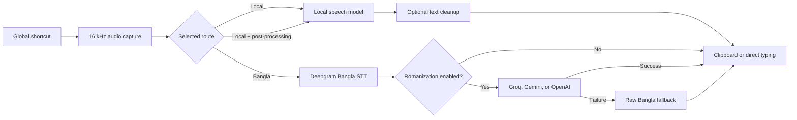

<p align="center">
  
</p>

# Kotha

Kotha is a cross-platform desktop speech-to-text application with a dedicated Bangla transcription and Romanization workflow. Press a global shortcut, speak, and Kotha places the result in the application you are already using.

Kotha is derived from [Handy](https://github.com/cjpais/Handy) by CJ Pais and its contributors. It retains Handy's local transcription foundation while adding the Kotha identity and an explicit Bangla cloud workflow.

## Why Kotha?

Kotha keeps ordinary dictation quick and private while giving Bangla speakers a separate path designed for readable Latin-script output:

- **Local-first dictation:** supported local models transcribe ordinary recordings on the device.
- **Bangla Romanization:** Deepgram transcribes Bangla speech, then an optional selected language-model provider converts the verified Bangla text to Latin script.
- **Predictable fallback:** if Romanization fails after successful Bangla transcription, Kotha pastes the original Bangla text instead of losing the result.
- **Works where you type:** configurable global shortcuts, clipboard handling, direct typing, and auto-submit integrate with other desktop applications.
- **User-controlled operation:** choose the microphone, model, language, shortcut behavior, overlay, history retention, and acceleration backend.

## Highlights

- Downloadable Whisper-family, Parakeet, Moonshine, and other supported local models.
- Automatic model capability detection for language selection, translation, acceleration, and streaming preview.
- Dedicated Bangla shortcut with Deepgram Nova-3 batch or WebSocket streaming transcription.
- Optional Bangla-to-Latin Romanization through Groq, Gemini, or OpenAI.
- Optional general transcript post-processing through supported language-model providers.
- Push-to-talk or press-to-toggle recording.
- Voice activity detection, filler-word removal, custom vocabulary, and configurable recording behavior.
- Microphone, input-channel, output-device, paste-method, overlay, and audio-feedback controls.
- Local transcription history with configurable retention.
- System tray operation and light/dark Kotha themes.
- macOS, Windows, and Linux support.

## How it works

Kotha has three explicit recording routes. The shortcut pressed at the start of a recording determines which route runs.



### Local transcription

1. Kotha records from the selected microphone and converts audio to 16 kHz mono.
2. Voice activity detection can filter silence before inference.
3. The selected model runs locally through `transcribe-cpp` or `transcribe-rs`.
4. Optional cleanup applies language-aware filler removal and custom-word correction.
5. Kotha records the local result in history and sends it to the configured paste path.

The post-processing shortcut follows the same local route, then sends the transcript to the configured post-processing provider before paste.

### Bangla transcription and Romanization

1. The dedicated Bangla shortcut records through the shared audio pipeline.
2. In default **batch** mode, audio remains local until recording stops and is then uploaded to the configured Deepgram endpoint.
3. In optional **streaming** mode, filtered audio frames are sent while recording. Recoverable streaming failures can fall back once to a batch request.
4. Kotha validates a non-empty Bangla transcript.
5. If Romanization is enabled, the transcript is sent to the selected Groq, Gemini, or OpenAI model.
6. A successful Latin-script result is pasted. If only Romanization fails, the verified raw Bangla transcript is pasted instead.

Bangla recordings stop automatically after two minutes. This route does not load a local speech model, write a WAV file, or create a transcription-history entry.

For the detailed implementation and failure contracts, see [KOTHA_CODEBASE_MAP.md](KOTHA_CODEBASE_MAP.md).

## Privacy and network boundaries

Kotha does not treat every route as offline. Network use depends on the feature you choose:

| Feature                        | Data leaving the computer                    | Destination                                |
| ------------------------------ | -------------------------------------------- | ------------------------------------------ |
| Local transcription            | None during transcription                    | —                                          |
| Model download                 | Model download request                       | Handy model infrastructure or Hugging Face |
| Bangla batch transcription     | Completed audio after recording stops        | Configured Deepgram endpoint               |
| Bangla streaming transcription | Filtered audio frames while recording        | Configured Deepgram endpoint               |
| Bangla Romanization            | Verified Bangla transcript                   | Selected Groq, Gemini, or OpenAI endpoint  |
| Optional post-processing       | Local transcription text and selected prompt | Selected post-processing provider          |

Provider API keys are entered by the user and stored in Kotha's application settings. They are redacted from diagnostic formatting, but the current implementation does not use the operating system keychain. Do not share `settings_store.json` or unreviewed logs.

## Quick start

### Install

When builds are available, download the package for your platform from [GitHub Releases](https://github.com/RmnFs/kotha/releases):

- **macOS:** `.dmg`
- **Windows:** `.msi` or `.exe` installer
- **Linux:** `.deb`, `.rpm`, or `.AppImage`

Kotha does not yet have maintainer-owned Apple notarization or Windows code-signing credentials. Your operating system may warn about downloaded builds. Only install artifacts you obtained from this repository's release page.

After launching:

1. Grant microphone permission.
2. On macOS, grant Accessibility permission so Kotha can type or paste into other applications.
3. Download and select a local model in **Settings → Models**.
4. Choose the microphone and confirm the ordinary transcription shortcut.
5. If you want Bangla transcription, configure its provider credentials separately.

### Default shortcuts

All shortcuts are configurable in Settings.

| Action                                   | macOS                | Windows/Linux      |
| ---------------------------------------- | -------------------- | ------------------ |
| Local transcription                      | `Option+Space`       | `Ctrl+Space`       |
| Local transcription with post-processing | `Option+Shift+Space` | `Ctrl+Shift+Space` |
| Bangla Romanization                      | `Option+Shift+B`     | `Ctrl+Shift+B`     |
| Cancel current operation                 | `Escape`             | `Escape`           |

Enable push-to-talk if you prefer holding the shortcut for the duration of a recording. Otherwise, press once to start and once to stop.

### Configure the Bangla workflow

Open **Settings → Bangla** and provide:

1. A Deepgram API key for Bangla speech recognition.
2. Batch or streaming transport. Batch is the privacy-conservative default.
3. Whether Romanization is enabled.
4. A Groq, Gemini, or OpenAI API key and model name if Romanization is enabled.
5. An optional provider timeout.

Deepgram transcription and Romanization credentials are separate. Turning Romanization off still sends audio to Deepgram, but the resulting transcript is pasted directly without being sent to a language-model provider.

## Models

The model selector downloads compatible local models and reports download progress, size, language support, and relevant capabilities. The catalog is compiled into Kotha, while model files are currently fetched from Handy's public model infrastructure and `handy-computer/*` Hugging Face repositories. Those external names remain unchanged intentionally.

### Application data and model locations

Kotha uses the application identifier `rmn.kotha`:

- macOS: `~/Library/Application Support/rmn.kotha/`
- Windows: `%APPDATA%\rmn.kotha\`
- Linux: `~/.config/rmn.kotha/`

Downloaded and user-provided models are stored under the `models` directory inside that location. Use **Settings → About → App Data Directory** to open the exact directory for the current installation.

Portable Windows installations keep settings and models in a `Data` directory beside the executable.

Because Kotha has its own application identifier, models previously downloaded by Handy under `com.pais.handy` are not automatically reused. They can be removed from the old Handy application-data directory when no longer needed.

### Manual and custom models

If the built-in downloader cannot operate behind a proxy or restricted network:

1. Open Kotha's application-data directory.
2. Create its `models` directory if it does not exist.
3. Download the exact catalog file from its listed Handy or Hugging Face source.
4. Preserve the expected filename or extracted directory name.
5. Place it under `models`, then use **Rescan Local Models** or restart Kotha.

Kotha can also discover user-provided compatible `.bin` and `.gguf` models. Model architecture and capabilities are inspected before the model is offered in Settings. Community models remain the user's responsibility and may not support every language, accelerator, translation, or streaming feature.

## Architecture

Kotha is a [Tauri 2](https://tauri.app/) desktop application with a React/TypeScript interface and a Rust backend.

| Layer                             | Responsibilities                                                                                             |
| --------------------------------- | ------------------------------------------------------------------------------------------------------------ |
| React + TypeScript                | Settings, onboarding, model selection, history controls, diagnostics, and recording overlay                  |
| Zustand + generated bindings      | Frontend state and typed Tauri command/event access                                                          |
| Rust/Tauri                        | Audio capture, model management, transcription, cloud adapters, shortcuts, tray, storage, and paste behavior |
| `cpal`, `rubato`, `vad-rs`        | Cross-platform audio input, resampling, and voice activity detection                                         |
| `transcribe-cpp`, `transcribe-rs` | Local speech-model loading and inference                                                                     |
| `rusqlite`                        | Local transcription history                                                                                  |

Important repository paths:

```text
src/
├── components/             Settings, model selection, history, and UI primitives
├── components/settings/    General, model, Bangla, post-processing, and debug settings
├── overlay/                Recording and live-transcription overlay
├── stores/                 Zustand settings and model state
├── i18n/locales/en/        English interface resources
└── bindings.ts             Generated Tauri-Specta commands, events, and types

src-tauri/src/
├── actions.rs              Recording route orchestration and terminal behavior
├── audio_toolkit/          Capture, resampling, VAD, language ID, and text cleanup
├── bangla_transcription/   Deepgram batch and streaming adapters
├── bangla_romanization.rs  Groq, Gemini, and OpenAI Romanization adapters
├── managers/               Audio, models, inference, and history
├── shortcut/               Global shortcut implementations and settings commands
├── paste_tx/               Receipt-aware macOS and Windows clipboard restoration
├── settings.rs             Persisted application settings and migrations
└── tray.rs                 Tray menu, state, and recent-transcription access
```

Further documentation:

- [KOTHA_CODEBASE_MAP.md](KOTHA_CODEBASE_MAP.md) — Bangla routing, network, cancellation, diagnostic, and fallback contracts.
- [BUILD.md](BUILD.md) — platform prerequisites and packaging.
- [DESIGN.md](DESIGN.md) — implemented Kotha interface and design system.
- [AGENTS.md](AGENTS.md) — repository rules for coding agents.

## Command line

Kotha supports remote control of an existing instance:

```text
kotha --toggle-transcription
kotha --toggle-post-process
kotha --cancel
```

Startup and diagnostic controls include:

```text
kotha --start-hidden
kotha --no-tray
kotha --debug
kotha --list-devices
kotha --list-models
kotha --help
```

Headless transcription uses an already-downloaded model and a 16 kHz mono WAV:

```bash
kotha --transcribe-file recording.wav --model MODEL_ID
kotha --transcribe-file recording.wav --device-index 0 --repeat 3 --json
```

Use `kotha --list-models --json` and `kotha --list-devices` to discover valid model IDs and compute-device indices.

## Platform notes

### macOS

- Supports Apple Silicon and Intel builds.
- Requires microphone permission and Accessibility permission for global typing/paste behavior.
- Apple Silicon can use Metal acceleration. Intel builds require the packaged ONNX Runtime for relevant models.
- Another application's Secure Input mode can temporarily prevent global keyboard shortcuts.

### Windows

- The release workflow builds x64 and ARM64 packages.
- Microphone access must be enabled in Windows privacy settings.
- Portable installation stores data beside the executable and does not create normal shortcuts or an uninstaller.
- Unsigned builds may trigger Microsoft Defender SmartScreen.

### Linux

- The release workflow builds x64 and ARM64 packages.
- GTK Layer Shell provides the native recording overlay where supported.
- X11 paste and typing work best with `xdotool`; Wayland can use `wtype`, `kwtype`, `dotool`, or `ydotool`, depending on the compositor.
- Packaged native runtime libraries live in Kotha's private bundle or `/usr/lib/Kotha/` rather than polluting the general system library directory.

## Troubleshooting

### Shortcuts stop responding on macOS

Another application may have enabled macOS Secure Input. Kotha shows a warning when it can identify this condition. Leave password fields, finish terminal password prompts, or quit the application holding Secure Input, then try the shortcut again.

### Linux overlay fails during startup

Install the GTK Layer Shell runtime for your distribution. To bypass layer-shell initialization and use the regular always-on-top fallback window, start Kotha with:

```bash
KOTHA_NO_GTK_LAYER_SHELL=1 kotha
```

### Linux transcribes but does not paste

Install a tool compatible with the active display server:

| Environment | Suggested tools                  |
| ----------- | -------------------------------- |
| X11         | `xdotool` or `ydotool`           |
| Wayland     | `wtype`, `dotool`, or `ydotool`  |
| KDE Wayland | `kwtype`, `dotool`, or `ydotool` |

Then select an available typing tool in Advanced Settings if automatic selection is not suitable. Tools based on `uinput`, including `ydotool`, can require a running daemon and additional group/device permissions.

### A model is missing after switching from Handy

Kotha and Handy use different application-data identifiers. The model remains in Handy's old `com.pais.handy` directory, while Kotha reads `rmn.kotha`. Download it again from Kotha or manually move/copy a compatible model into Kotha's `models` directory.

### Bangla transcription or Romanization fails

- Confirm the Deepgram key is present for transcription.
- Confirm the selected Romanization provider has its own key and a valid model name.
- Check that the configured endpoint is reachable and that the provider account has quota.
- If streaming fails repeatedly, switch to batch mode to isolate WebSocket or proxy problems.
- If Deepgram succeeded but Romanization failed, raw Bangla should still be pasted.

Enable Debug Mode with `Cmd+Shift+D` on macOS or `Ctrl+Shift+D` on Windows/Linux to view a content-free summary of the latest Bangla operation. Diagnostics include stage timing and provider metadata, not transcript or response content.

### Logs

Open **Settings → About → Log Directory**. Before sharing a log, remove transcript text, prompts, endpoints, file paths, API keys, and any other private information. Reproducible bugs can be reported through [GitHub Issues](https://github.com/RmnFs/kotha/issues).

## Development

Requirements:

- Current stable [Rust](https://rustup.rs/)
- [Bun](https://bun.sh/)
- CMake and a suitable native C/C++ toolchain
- The operating-system dependencies documented in [BUILD.md](BUILD.md)

Clone and run:

```bash
git clone https://github.com/RmnFs/kotha.git
cd kotha
bun install
bun run tauri dev
```

Quality checks:

```bash
bun run build
bun run lint
bun run format:check
cargo test --manifest-path src-tauri/Cargo.toml
```

Build a platform bundle with:

```bash
bun run tauri build
```

## CI, releases, and updates

The repository keeps three focused GitHub Actions workflows:

- `checks.yml` builds, lints, formats, and tests pushes to `main`.
- `build.yml` is the reusable macOS, Windows, and Linux packaging workflow.
- `release.yml` is manually triggered and creates a draft GitHub Release with platform installers.

Automatic in-app updates and updater artifacts are disabled until Kotha has its own updater signing key. Apple notarization and Windows code signing also require maintainer-owned credentials.

## Repository policy

This is currently a maintainer-led project and is not seeking external pull requests. Reproducible bug reports are welcome through [GitHub Issues](https://github.com/RmnFs/kotha/issues).

The `upstream` Git remote may continue to point to the original Handy repository so useful fixes can be reviewed and selectively integrated. Kotha-owned names, identifiers, data paths, release artifacts, and documentation remain independent.

## License and lineage

Kotha is distributed under the [MIT License](LICENSE). The original Handy copyright and license notice are preserved as required.

- Kotha repository: [RmnFs/kotha](https://github.com/RmnFs/kotha)
- Upstream project: [cjpais/Handy](https://github.com/cjpais/Handy)

Kotha also depends on open-source projects including Tauri, React, transcribe.cpp, transcribe-rs, ggml, and their respective dependencies.
